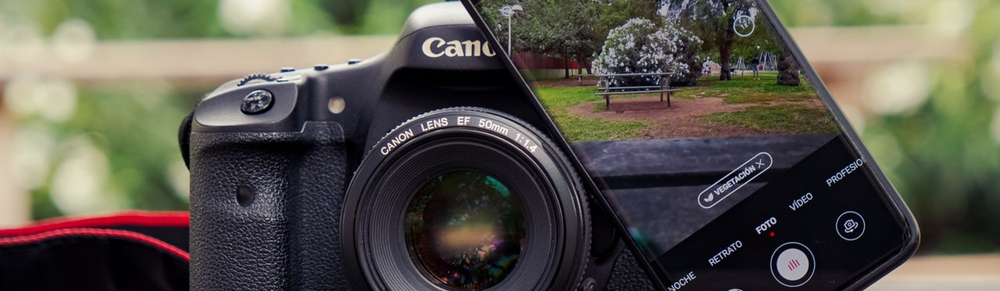

# 📸 PhotoDateRenamer

**PhotoDateRenamer** es una herramienta en Python que renombra automáticamente tus fotos utilizando los metadatos EXIF, concretamente la fecha en que fueron tomadas. El nuevo nombre de la foto seguirá el formato `YYYY_MM_DD_nombreOriginal.jpg`, facilitando la organización cronológica de tus imágenes.

## ✨ Características

- Renombra fotos utilizando la fecha en la que fueron tomadas.
- Compatible con formatos de imagen como `.jpg`, `.jpeg`, `.png`, `.tiff`.
- Facilita la organización cronológica de tus imágenes.
- Preserva el nombre original de la foto, concatenándolo después de la fecha.

## 🛠️ Requisitos

Antes de comenzar, asegúrate de tener instalados los siguientes paquetes de Python:

- **Python 3.6+**
- **Pillow** (para manejar los metadatos EXIF de las imágenes)

### Instalación de Dependencias

Para instalar Pillow, puedes utilizar `pip`:

```bash
pip install pillow
```

## 🚀 Uso
1. Clona o descarga el repositorio
```bash
git clone https://github.com/usuario/PhotoDateRenamer.git
cd PhotoDateRenamer
```
2. Coloca tus fotos en el directorio
Mueve las fotos que deseas renombrar al directorio donde está ubicado el script. También puedes especificar un directorio diferente en el código.

📂 Estructura del Proyecto:
```bash
PhotoDateRenamer/
│
├── rename_photos.py        # El script principal de renombrado de fotos
├── README.md               # Documentación del proyecto
├── mi_directorio_con_fotos # El directorio donde están las fotos 
```

3. Ejecuta el script
Para ejecutar el script, usa el siguiente comando:
```bash
python rename_photos.py
```
El script recorrerá todas las fotos en el directorio actual (o en el directorio especificado) y renombrará las que contengan metadatos EXIF con la fecha en que fueron tomadas.

4. Resultado
Cada imagen que tenga metadatos EXIF con la fecha original será renombrada en el formato `YYYY_MM_DD_nombreOriginal.ext`. Si una imagen no tiene la fecha en sus metadatos, el script la omitirá.


✍️ Personalización:

Si deseas cambiar el directorio de las fotos, simplemente edita la variable directorio_de_fotos en el script rename_photos.py: (línea 44)
```bash
directorio_de_fotos = './mi_directorio_con_fotos'
```
💡 Consideraciones
- El script solo renombra las fotos que contienen metadatos EXIF con el campo DateTimeOriginal.
- Asegúrate de hacer una copia de seguridad de tus fotos antes de ejecutar el script, en caso de que quieras conservar los nombres originales.


